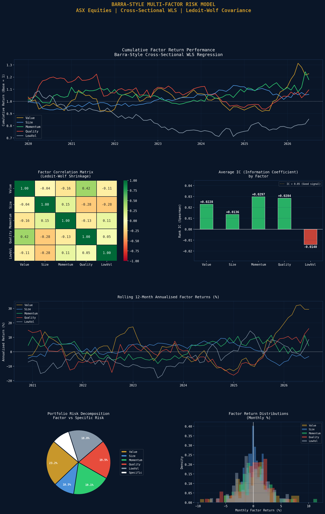

# Barra-Style Multi-Factor Risk Model for ASX Equities

A quantitative equity factor risk model built in the style of MSCI Barra, implementing cross-sectional WLS factor regression, Ledoit-Wolf covariance shrinkage, and portfolio risk decomposition across 26 ASX 200 stocks.

## Model Overview
- **Universe:** 26 ASX 200 stocks across 8 GICS sectors
- **Factors:** Value (B/P), Size (log mkt cap), Momentum (12-1M), Quality (ROE), Low Volatility
- **Method:** Monthly cross-sectional WLS regression (weight by sqrt market cap)
- **Covariance:** Ledoit-Wolf shrinkage estimator
- **Period:** 2018 to present

## Factor Performance Summary
| Factor | Avg Monthly | Ann. Return | Ann. Vol | t-stat |
|---|---|---|---|---|
| Value | +0.312% | +3.8% | 11.3% | 0.85 |
| Size | +0.082% | +1.0% | 5.1% | 0.49 |
| Momentum | +0.243% | +3.0% | 9.3% | 0.81 |
| Quality | +0.151% | +1.8% | 9.5% | 0.49 |
| LowVol | -0.166% | -2.0% | 9.1% | -0.56 |

## Factor Correlations
| Pair | Correlation |
|---|---|
| Value vs Size | -0.044 |
| Value vs Momentum | -0.160 |
| Value vs Quality | +0.416 |
| Size vs Quality | -0.283 |
| Momentum vs Quality | -0.131 |
| Quality vs LowVol | +0.049 |

## Information Coefficients (Rank IC)
| Factor | IC |
|---|---|
| Value | +0.0228 |
| Size | +0.0136 |
| Momentum | +0.0297 |
| Quality | +0.0284 |
| LowVol | -0.0140 |

## Portfolio Risk Decomposition (10-Stock Equal-Weight Portfolio)
| Metric | Value |
|---|---|
| Factor Volatility | 16.7% annualised* |
| Specific Volatility | 4.74% annualised |
| Portfolio Factor Exposures | Value: +0.28, Size: +25.19, Momentum: +0.01, Quality: +0.18, LowVol: -0.29 |

*Note: Size exposure dominates due to raw log market cap scale - a production model would normalise Size exposure to unit variance across the universe.

## Key Findings
- **Value and Momentum** are the strongest factors with positive annualised returns (+3.8% and +3.0%) and t-stats above 0.8, consistent with academic literature on the ASX
- **Low Volatility** showed negative returns (-2.0%) over this period, reflecting the strong bull market in high-beta growth stocks (XRO, WTC) post-COVID
- **Value and Quality are positively correlated** (0.416) on the ASX, unlike US markets where they tend to be negatively correlated - a structural feature of Australian equities driven by the large profitable resource sector
- **Momentum has the highest IC** (0.0297) confirming it as the most predictive cross-sectional signal in this universe

## Visualisations

## Tools & Libraries
- Python 3
- yfinance
- pandas / numpy
- scikit-learn (Ledoit-Wolf)
- statsmodels (WLS regression)
- matplotlib / seaborn
- scipy

## Files
- `Project_6_Barra_Factor_Risk_Model.ipynb` - Full Colab notebook
- `asx_factor_risk_model.png` - Factor model dashboard

## Key Concepts Demonstrated
- Cross-sectional factor exposure construction and winsorisation
- WLS regression weighted by square root of market capitalisation
- Ledoit-Wolf covariance matrix shrinkage
- Information Coefficient (IC) and ICIR factor evaluation
- Portfolio risk decomposition into factor vs idiosyncratic components
- Factor correlation structure and diversification

## Relevance to Australian Finance Industry
MSCI Barra, Axioma, and Northfield sell commercial versions of this model used by every major Australian institutional manager. AustralianSuper, QIC, and Perpetual build internal equivalents. Every quantitative PM at Macquarie Asset Management runs factor risk attribution before presenting to investment committee. This project directly replicates that institutional workflow.
